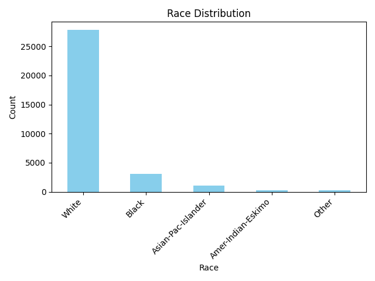

# Results

The demographic analysis of the dataset provides the following insights:

- **Race Count**: Distribution of the number of people of each race.
  - Results: [View Results](../results/analysis_results.txt)

- **Average Age of Men**: The average age of male individuals in the dataset.
  - Results: [View Results](../results/analysis_results.txt)

- **Percentage with Bachelor's Degree**: The percentage of individuals with a Bachelor's degree.
  - Results: [View Results](../results/analysis_results.txt)

- **Percentage with Advanced Education and Earning >50K**: The percentage of individuals with advanced education earning more than 50K.
  - Results: [View Results](../results/analysis_results.txt)

- **Percentage without Advanced Education and Earning >50K**: The percentage of individuals without advanced education earning more than 50K.
  - Results: [View Results](../results/analysis_results.txt)

- **Minimum Work Hours**: The minimum number of hours worked per week.
  - Results: [View Results](../results/analysis_results.txt)

- **Percentage of People Working Minimum Hours and Earning >50K**: The percentage of people working minimum hours and earning more than 50K.
  - Results: [View Results](../results/analysis_results.txt)

- **Country with Highest Percentage of People Earning >50K**: The country with the highest percentage of individuals earning more than 50K.
  - Results: [View Results](../results/analysis_results.txt)

- **Most Popular Occupation in India for >50K Earners**: The most common occupation among individuals in India earning more than 50K.
  - Results: [View Results](../results/analysis_results.txt)

## Visualizations
- **Race Distribution**: Provides a visual breakdown of the number of people of each race.
  - 

- **Education vs Income**: Shows the distribution of education levels among individuals earning more than 50K.
  - 
